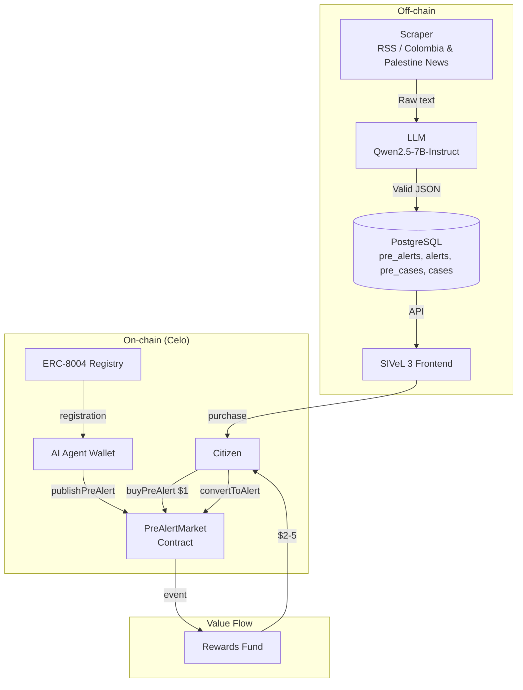

# R-#36: AI Agent for Pre-Alerts (ERC-8004)

**Closed (2026-06-25) — MVP phase completed.** Side sivel.xyz: marketplace, endpoints, frontend, scoring operational. Side sivel3agent: base structure, scraper, pipeline, cron running (8/15 REQs). Remaining agent work tracked in REQ/53.

Implement an onchain AI agent that autonomously detects potential political violence events in **Colombia and Palestine** and publishes them as **pre‑alerts** following the **SIVeL methodology** (see `doc/SKILL.md`). The agent is registered under **ERC-8004** (Agent Trust Protocol), making it discoverable and verifiable on Celo.

**Instead of plain text**, the agent produces **structured JSON** conforming to `doc/relato.schema.json`. This JSON can be:
- Displayed in a friendly form for citizens who buy the pre‑alert
- Converted to XML for import into the SIVeL 2 legacy system
- Validated automatically against the schema

This is the first step toward a decentralized marketplace where citizens buy pre‑alerts, investigate them, and earn rewards for verified alerts.

---

## Alignment with VISION.md

| VISION.md Requirement | Implementation |
|:---|:---|
| **AI Agent** monitors public sources (RSS, APIs) | ✅ Scraper runs every 6 hours |
| Generates **pre-alerts** as JSON (SIVeL methodology) | ✅ `relato.schema.json` compliance |
| **Citizens buy** pre-alerts for $1 in USDT/SLEARN/COPm | ✅ `buyPreAlert()` |
| Citizens **investigate and improve** | ✅ Editable form + re‑validation |
| Citizens **convert** to citizen alert | ✅ `convertToAlert()` |
| **Documenters verify** and receive rewards | ✅ Depends on #10 |
| **Rewards fund** transparent (on‑chain) | ✅ Events + public contract |
| **Sustainability**: professional revenue + donations | ✅ Citizen receives $2‑$5 per verified alert |

### Ecosystem Actors (VISION.md §3)

| Actor | Implementation |
|:---|:---|
| **AI Agent** (§3.2) | ERC‑8004 registered, dedicated wallet, cron job |
| **Citizens** (§3.1) | Buy pre‑alerts, investigate, convert (max 1/day) |
| **Documenters** (§3.2) | Verify converted alerts |
| **Regional Validators** (§3.2) | Final audit (off‑chain, CINEP) |

### Pre‑alert Market (VISION.md §4)

| Requirement | Implementation |
|:---|:---|
| Browse pre‑alerts on map | ✅ Special 🤖 markers (only for verified learn.tg users) |
| Pay $1 (USDT/SLEARN/COPm) | ✅ `buyPreAlert()` |
| Investigate and improve | ✅ Editable form with pre‑filled fields |
| Submit as alert | ✅ `convertToAlert()` + JSON validation |
| Citizen reward $2‑$5 | ✅ Depends on #8 (alert fund) |
| Rate limiting | ✅ Max 1 conversion per citizen per day |

---

## Key Design Decisions

| Decision | Rationale | VISION Alignment |
|:---|:---|:---|
| **ERC-8004 Registry** | On‑chain verifiable agent identity | Transparency (§7) |
| **Agent Type: `Scout`** | Real‑world event discovery | ERC-8004 standard |
| **Dedicated wallet** | Agent wallet linked to project main wallet | Security, source confidentiality (§1) |
| **Pull‑Based Discovery** | Cron every 6 hours, scrapes local news | Agent autonomy (§4) |
| **Output: JSON conforming to `relato.schema.json`** | Same format as human documenters, auto‑validation, legacy compatible | Common methodology (§4) |
| **Minimal on‑chain storage** | Only JSON hash, location hash, timestamp | Gas efficient, open data (§1) |
| **Semantic duplicate detection** | pgvector embeddings to avoid duplicates, link sources | Data integrity, no spam |
| **Source tracking** | `agent_fuente` table with original URLs | Transparency, auditability |
| **`has_more_info` flag** | Notifies when additional news appears | Citizen engagement |
| **Webhook feedback loop** | Agent receives `pre_alert_bought/converted/verified` events | Continuous learning |
| **Purchase fee $1** | Anti‑spam, accessible. SLEARN requires premium SBT | Pre‑alert market (§4) |
| **Reward $2‑$5** | Quality‑based compensation | Sustainability (§6) |
| **Rate limit 1/day** | Prevents spam | System integrity |

---

## Roles and Permissions (full design)

| Role | On‑chain identifier | How to obtain | Permissions |
|:---|:---|:---|:---|
| **AI Agent** | `AGENT_ROLE` (ERC-8004) | Registered via ERC‑8004 | Publish pre‑alerts (`Pending`), soft discard |
| **Citizen** | Any wallet | None | Buy pre‑alerts, convert to alerts, submit direct alerts |
| **Documenter** | `DOCUMENTER_ROLE` (SBT) | Granted by operator/validator | Review alerts (score), mark `NeedsMoreInfo`, approve `PreCase`, discard |
| **Validator** | `VALIDATOR_ROLE` (SBT) | Granted by operator | Off‑chain final approval (CINEP). Can also mark `NeedsMoreInfo` on‑chain. |
| **Operator** | `DEFAULT_ADMIN_ROLE` | Project owner | Superuser: change any state, freeze/unfreeze, manage roles |

---

## State Machine (simplified for reference, full in #46)

**Pre‑alert states** (simplified for this epic):
- `Pending` – published, not bought.
- `Reserved` – bought, awaiting conversion (7 days deadline).
- `NeedsMoreInfo` – documenter requests more information.
- `PendingWithAdditionalInfo` – agent found more info, back to market.
- `Expired` – reserved but not converted in time.
- `DiscardedByAgent` – agent soft‑discarded (duplicate >0.95).
- `ConvertedByCitizen` – citizen converted to alert.
- `ConvertedByDocumenter` – documenter directly created a pre‑case.
- `Frozen` – permanently rejected; agent cannot recreate.

**Alert states** (after citizen conversion):
- `UnderReview` – in queue.
- `ScoredByDocumenter` – documenter assigned score 1‑5.
- `DiscardedByDocumenter` – rejected.

**Pre‑case states**:
- `Approved` – documenter approved.
- `Linked` – linked to an imported case from CINEP.

**Case states** (imported from CINEP/SIVeL 2):
- `Imported` – loaded.
- `Linked` – linked to pre‑case/alert, bonus paid.

Full state machine diagrams and transitions are documented in issue #46.

---

## Marketplace Visibility

The pre‑alert layer on the `sivel.xyz` map is **only visible to citizens who are verified in learn.tg** (KYC via Self protocol).  
Frontend calls `GET https://learn.tg/api/verify?wallet=...` (signed request); only if `verified: true` the pre‑alert layer is activated.

Visible states: `Pending` and `PendingWithAdditionalInfo`.  
`Reserved`, `Expired`, `DiscardedByAgent`, `NeedsMoreInfo`, etc., are **not** shown to citizens.

---

## Data Flow with Embeddings and Similarity (pgvector)

All relevant tables (`pre_alerts`, `alerts`, `pre_cases`, `cases`) have an `embedding VECTOR(384)` column. Embeddings are generated by a dedicated **embedding model** (e.g., `BAAI/bge-m3` running on CPU).

**Deduplication** (when agent creates a new pre‑alert):
1. Generate embedding for the new pre‑alert.
2. Query against existing `pre_alerts`, `alerts`, `pre_cases`, `cases` with `1 - (embedding <=> :embedding) > 0.85`.
3. Similarity ≥ 0.95 → mark `DiscardedByAgent`.
4. Similarity between 0.85 and 0.95 → mark `NeedsMoreInfo`.
5. Otherwise → publish as `Pending`.

**Linking imported cases** (script #3):
- Compute embedding for new case.
- Search `pre_cases` and `alerts` for similarity > 0.85.
- Create links, pay bonus $3.5 for alerts, update status to `Linked`.

---

## LLM Architecture (Three Models)

| Model | VRAM (4‑bit) | Task |
|:---|:---|:---|
| **`sqlCoder-Qwen2.5-14B`** | ~9 GB | Generate SQL from natural language (researcher queries) |
| **`Qwen2.5-7B-Instruct`** | ~5 GB | Extract pre‑alerts from news, complete `NeedsMoreInfo` pre‑alerts, suggest alert scores (post‑MVP) |
| **Embedding model** (e.g., `BAAI/bge-m3` on CPU) | 0 GB | Generate embeddings for all text content |

**Total VRAM:** ~14 GB (fits in RX 9060 XT 16GB).  
For hackathon MVP, only `Qwen2.5-7B-Instruct` is used (no embeddings, use simple hash deduplication).

---

## Interaction with Smart Contracts (`PreAlertMarket.sol`)

The on‑chain contract is **minimal**:
- Stores only `eventHash`, `locationHash`, `timestamp`, `publisher`.
- Handles `buyPreAlert` (payment) and `convertToAlert` (marks as converted).
- Does **not** store the full state machine (states are off‑chain in PostgreSQL).
- Emits events that the off‑chain indexer uses to update local state.

**Why off‑chain state machine?**  
Cheaper (no gas), more flexible, easier to evolve. The blockchain only certifies existence and purchase.

---

## Payment Flows

### Citizen Rewards (from Alert Fund)

| Event | Amount |
|:---|:---|
| Convert pre‑alert → alert (score 1‑5) | $2 – $5 (based on documenter score) |
| Direct alert (score 1‑5) | $2 – $5 |
| Pre‑alert bought, expired, later converted by documenter | $1.5 |
| Alert linked to an imported case (bonus) | +$3.5 |

### Documenter Rewards

Documenters receive a **monthly stipend** (max $300) distributed proportionally to their work (number of alerts reviewed, pre‑cases approved). No per‑action fixed payments. Stipend calculated off‑chain based on available funds and workload.

---

## Architecture Diagram

Note: Agent does NOT receive direct payment. Revenue flows to the project to sustain operations.

---

Output Format: Structured JSON

The agent must generate JSON that conforms to doc/relato.schema.json.
Example (see original issue for full example).
If a field cannot be determined, omit it or set to null. Never fabricate information.

---

Tasks (High‑level)

Detailed implementation is split into subtasks #40 … #53.
The checklist below summarises the main milestones.

1. Agent Registration (ERC-8004)
   · Generate dedicated wallet (bin/m wallet:generate)
   · Fund wallet with CELO (gas)
   · Register agent on ERC-8004 (Celo testnet/mainnet) – agentType: Scout
   · Verify registration
2. Backend Agent (Scraper + LLM + JSON Generator + Deduplication)
   · Scraper for Colombia & Palestine (RSS, keyword searches)
   · LLM (Qwen2.5-7B-Instruct) extraction → JSON conforming to relato.schema.json
   · Validate JSON with ajv
   · Semantic duplicate detection (pgvector) against existing cases/pre‑alerts
   · Store JSON off‑chain (PostgreSQL) + optionally IPFS
   · Publish on‑chain via PreAlertMarket.sol (JSON hash + location hash)
3. Smart Contract: PreAlertMarket.sol
   · Functions: publishPreAlert, buyPreAlert, convertToAlert
   · Rate limiting (1 conversion per citizen per day)
   · SLEARN payment validation (requires premium SBT from learn.tg)
   · Events for each action
   · Deploy on Alfajores → Mainnet
4. Frontend Integration (SIVeL 3)
   · Map layer for pre‑alerts (🤖 markers) – only for verified learn.tg users
   · “Buy Pre‑alert” button (USDT/COPm/SLEARN)
   · Friendly editable form after purchase
   · “Improve and Convert to Alert” button (re‑validation, rate limit check)
   · API endpoints /api/pre-alerts and /api/pre-alerts/convert
5. Economics & Notifications
   · COPm and SLEARN payments
   · Reward: $2‑$5 per verified alert
   · Source tracking (agent_fuente + relations)
   · has_more_info flag and notifications
   · Webhook (/api/agent/webhook) to receive events from sivel.xyz

---

Subtasks (Implementation Breakdown)

The work is split into the following concrete issues:

### sivel3agent (REQ/1–15)

| # | Task | Status |
|---|------|--------|
| 1 | Base agent structure | ✅ |
| 2 | DB tables (sources, evidence) | ✅ |
| 4 | RSS/news scraper Colombia | ✅ |
| 6 | Pipeline principal | ✅ |
| 7 | Pre-alert generation + storage | ✅ |
| 8 | Cron jobs + automation | ✅ |
| 9 | Monitoring | ✅ |
| 10 | Golden evaluation dataset | ✅ |
| 3 | Case sync from sivel2 | ⏳ |
| 5 | Semantic duplicate detection | ⏳ |
| 11 | Aggression code classification | ⏳ |
| 12 | Scraper classification | ⏳ |
| 13 | LLM data quality | ⏳ |
| 14 | GPU infrastructure | ⏳ |
| 15 | XML↔JSON converters | ⏳ |

### sivel3 (este repo)

| # | Task | Status |
|---|------|--------|
| 43 | PreAlertMarket.sol | ✅ |
| 44 | /api/pre-alerts endpoints | ✅ |
| 45 | ERC-8004 agent registration | ✅ |
| 47 | RewardEscrow | ✅ |
| 48 | Frontend map + dashboard + documenter | ✅ |

---

Acceptance Criteria

· Agent registered on ERC-8004 (testnet/mainnet) with valid agentURI and agentType = Scout
· Agent script runs autonomously every 6 hours and publishes at least one pre‑alert on‑chain for Colombia and Palestine
· Pre‑alert JSON is valid against doc/relato.schema.json
· Citizen with MiniPay can:
  · Connect wallet
  · Buy pre‑alert for $1.00 using USDT, COPm, or SLEARN (SLEARN only with premium SBT)
  · View details in friendly form
  · Edit, improve, and convert to citizen alert
· Rate limiting: max 1 conversion per citizen per day
· Converted alert stored in database and passes schema validation
· All transactions (buy, convert) visible on CeloScan with corresponding events
· COPm and SLEARN payments work
· Duplicate detection prevents creation of identical pre‑alerts (using pgvector for MVP, hash for hackathon)
· New sources are linked to existing cases/pre‑alerts and has_more_info triggers notifications
· Webhook receives events from sivel.xyz
· (Full design) Documenter stipend and bonus $3.5 for case links work

---

Dependencies

Issue Description
#8 Citizen Alert Submission with Wallet Verification (pre-alert market)
#10 Documenter Dashboard (verifies alerts, triggers rewards)
#9 Role-Based SBTs for Documenters (optional for demo)
SKILL.md SIVeL methodology and relato.schema.json

---

Estimated Effort (Epic Total)

Task Area Hours
Agent registration + wallet setup 2
Scraper + LLM + JSON generator 10-12
Smart contract (with rate limiting) 6-8
Frontend integration 8-10
COPm + SLEARN integration 3-4
Deduplication + source tracking 4-5
Notifications + webhook 5-6
Testing & deployment 4
Total ~42‑51

---

Related Issues

· #8 – Citizen Alert Submission
· #10 – Documenter Dashboard
· #9 – Role SBTs for Documenters

---

Simplification for Hackathon (MVP)

For the hackathon deadline (June 15), the following features are excluded:

· sqlCoder (researcher queries)
· NeedsMoreInfo / auto‑completion
· Embedding‑based deduplication (use simple event_hash instead)
· Documenter scoring and stipend (use fixed $5 reward for demo)
· Bonus $3.5 for case linking
· Validator role (off‑chain only)
· Frozen state
· PreCase and linking to cases (just show conversion to alert)

MVP state machine (only on‑chain + minimal off‑chain):
Pending → Reserved → ConvertedByCitizen (off‑chain).

MVP components:

· 1 model: Qwen2.5-7B-Instruct for extraction only.
· No embeddings (use event_hash = keccak256 of JSON).
· Contract PreAlertMarket.sol with only publishPreAlert, buyPreAlert, convertToAlert.
· Simple PostgreSQL table for pre‑alerts and alerts.
· Frontend map layer visible only to verified learn.tg users (call /api/verify).

---

"Whatever you do, work at it with all your heart, as working for the Lord, not for human masters." (Colossians 3:23)
