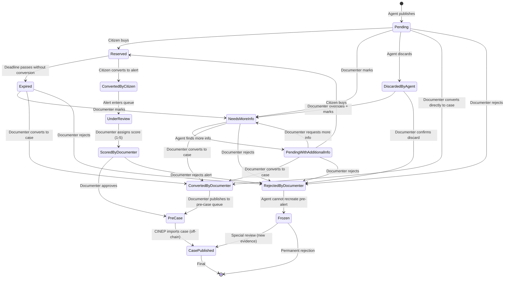

## Description

This issue defines the **complete state machine** for the SIVeL 3 agent ecosystem, covering:

- **Pre‑alerts** (generated by the AI agent)
- **Alerts** (submitted by citizens, either from purchased pre‑alerts or directly)
- **Pre‑cases** (approved by documenters, awaiting CINEP publication)
- **Cases** (imported from CINEP / SIVeL 2)

It also defines **roles** and their permissions, the **marketplace visibility** for citizens (wallet-connected users see the pre‑alert layer; learn.tg verification required for buying), the **data flow** including embeddings for similarity detection, and the **notification logic** that triggers user alerts based on state transitions.

**This is the reference design for full implementation.**  
For the hackathon MVP, a simplified subset is used (see “Simplification for hackathon” at the end).

---

## State machine diagram



**Note on `CasePublished`:** This state is reached off‑chain when CINEP publishes a case. The import script (#3) links the on‑chain `PreCase` to the imported case and pays bonuses.

---

## Roles and permissions

| Role | Identifier | How to obtain | Permissions |
|------|------------|---------------|-------------|
| **AI Agent** | `AGENT_ROLE` (on‑chain) | Registered via ERC‑8004, wallet known | Publish pre‑alerts (`Pending`), mark `DiscardedByAgent` (soft discard) |
| **Citizen** | Any wallet | None | Buy pre‑alerts, convert to alerts (if buyer), submit direct alerts |
| **Documenter** | `DOCUMENTER_ROLE` (SBT on `PasosDeJesusCredentials`) | Granted by operator or validator | Review alerts (score), mark `NeedsMoreInfo`, approve `PreCase`, discard, override agent discard |
| **Validator** | `VALIDATOR_ROLE` (SBT, e.g., CINEP) | Granted by operator | Final approval of cases (off‑chain), but can also mark `NeedsMoreInfo` or reject (on‑chain state is `PreCase` – validator works off‑chain) |
| **Operator** | `DEFAULT_ADMIN_ROLE` (on‑chain) | Project owner | Superuser: can change any state, freeze/unfreeze, manage roles |

**Note:** The validator’s main work is off‑chain (CINEP internal process). On‑chain, the final state is `PreCase`. When CINEP publishes a case, the import script links it to a `PreCase` or Alert via similarity.

---

## State machine details

### Pre‑alert states

| State | Description | Who can transition to this state? | Allowed transitions |
|-------|-------------|-----------------------------------|---------------------|
| `Pending` | Published, not yet bought. Visible in marketplace. | Agent (initial) | → `Reserved` (citizen buys) <br>→ `NeedsMoreInfo` (documenter) <br>→ `DiscardedByAgent` (agent) <br>→ `ConvertedByDocumenter` (documenter) |
| `Reserved` | Bought by a citizen, awaiting conversion within deadline. | Citizen (via `buyPreAlert`) | → `ConvertedByCitizen` (citizen converts) <br>→ `Expired` (deadline passes) |
| `NeedsMoreInfo` | Documenter marked it as incomplete; agent should search for more sources. | Documenter, Validator, Operator | → `PendingWithAdditionalInfo` (agent completes) <br>→ `ConvertedByDocumenter` (documenter) |
| `PendingWithAdditionalInfo` | Agent found more information; ready for purchase again. | Agent (via LLM completion) | → `Reserved` (citizen buys) <br>→ `NeedsMoreInfo` (documenter) <br>→ `ConvertedByDocumenter` (documenter) |
| `Expired` | Reserved pre‑alert not converted in time. | System (timeout) | → `NeedsMoreInfo` (documenter) <br>→ `ConvertedByDocumenter` (documenter) |
| `DiscardedByAgent` | Agent soft‑discarded (e.g., duplicate >0.95). | Agent | → `NeedsMoreInfo` (documenter overrides) <br>→ `Frozen` (documenter confirms discard) |
| `ConvertedByCitizen` | Citizen converted to alert. | Citizen | Alert enters queue (no further pre‑alert transitions) |
| `ConvertedByDocumenter` | Documenter directly converted pre‑alert to a pre‑case (without citizen). | Documenter, Operator | → `PreCase` created |
| `Frozen` | Permanently rejected; agent cannot recreate the same event hash. | Documenter, Validator, Operator | → (none, except special override by operator/validator to `CasePublished` if new evidence) |

### Alert states (after citizen conversion)

| State | Description | Allowed transitions |
|-------|-------------|---------------------|
| `UnderReview` | Alert in queue, waiting for documenter. | → `ScoredByDocumenter` (documenter assigns score) <br>→ `DiscardedByDocumenter` (rejected) |
| `ScoredByDocumenter` | Documenter assigned a quality score (1–5). | → `PreCase` (documenter approves) <br>→ `DiscardedByDocumenter` |
| `DiscardedByDocumenter` | Alert rejected. No payment to citizen. | → `Frozen` (for linked pre‑alert, if any) |

### Pre‑case states

| State | Description |
|-------|-------------|
| `Approved` | Documenter approved this pre‑case. It will be linked to a future case from CINEP. |
| `Linked` | The pre‑case has been linked to an imported case (from CINEP). |

### Case states (imported from CINEP / SIVeL 2)

| State | Description |
|-------|-------------|
| `Imported` | Case loaded from external source. |
| `Linked` | Linked to one or more pre‑cases or alerts (bonus paid). |

---

## Marketplace visibility (map layer)

The pre‑alert layer on the `sivel.xyz` map is **visible to any connected wallet** via the Casos/PreAlertas mode toggle.  
**Buying** pre‑alerts requires learn.tg verification (KYC via Self protocol) — non‑verified users see an info box with a link to learn.tg.

**Verification check:**
- Frontend calls `GET https://learn.tg/api/verify?wallet=...` (EIP‑191 signed request).
- Only if `verified: true` the buy button is shown.

**Visible pre‑alert states:** `Pending` and `PendingWithAdditionalInfo`.  
`Reserved`, `Expired`, `DiscardedByAgent`, `NeedsMoreInfo`, etc., are **not** shown to citizens.

---

## Data flow with embeddings and similarity

### Tables (PostgreSQL + pgvector)

All tables have an `embedding VECTOR(384)` column (or 1536, depending on model). Embeddings are generated by a dedicated **embedding model** (e.g., `BAAI/bge-m3` running on CPU).

| Table | Purpose |
|-------|---------|
| `pre_alerts` | Active pre‑alerts (states `Pending`, `Reserved`, `NeedsMoreInfo`, `PendingWithAdditionalInfo`, `Expired`, `DiscardedByAgent`) |
| `alerts` | Citizen alerts (`UnderReview`, `ScoredByDocumenter`, `DiscardedByDocumenter`) |
| `pre_cases` | Approved pre‑cases (`Approved`, `Linked`) |
| `cases` | Imported cases from CINEP |

### Deduplication (when agent creates a new pre‑alert)

1. Generate embedding for the new pre‑alert (using the embedding model).
2. Query against `pre_alerts`, `alerts`, `pre_cases`, `cases` with `1 - (embedding <=> :embedding) > 0.85`.
3. If any similarity ≥ 0.95 → mark pre‑alert as `DiscardedByAgent` (duplicate).
4. If any similarity between 0.85 and 0.95 → mark pre‑alert as `NeedsMoreInfo` (possible duplicate, require documenter review).
5. Otherwise → publish as `Pending`.

### Linking imported cases to pre‑cases / alerts (script #3)

When a new case is imported from CINEP:
- Compute its embedding.
- Search `pre_cases` and `alerts` for similarity > 0.85.
- For each match:
  - Create link in `pre_case_case_link` table.
  - If the match is an `alert` that has not yet received the case‑link bonus ($3.5), trigger payment via `AlertRewards` contract.
  - Update `pre_case` or `alert` status to `Linked`.

---

## LLM roles (three‑model architecture)

| Model | VRAM (4‑bit) | Task |
|-------|--------------|------|
| **`sqlCoder-Qwen2.5-14B`** | ~9 GB | Generate SQL from natural language (researcher queries) |
| **`Qwen2.5-7B-Instruct`** | ~5 GB | Extract pre‑alerts from news, complete `NeedsMoreInfo` pre‑alerts, suggest alert scores (post‑MVP) |
| **Embedding model** (e.g., `BAAI/bge-m3` on CPU) | 0 GB | Generate embeddings for all text content |

**Total VRAM:** ~14 GB (fits in RX 9060 XT 16GB).

---

## Interaction with smart contracts

The on‑chain contract `PreAlertMarket.sol` (issue #43) is **minimal**:

- Only stores `eventHash`, `locationHash`, `timestamp`, `publisher`.
- Handles `buyPreAlert` (payment) and `convertToAlert` (marks as converted).
- Does **not** store the full state machine – states are tracked off‑chain (PostgreSQL).
- The contract emits events that the off‑chain indexer uses to update local state.

**Why off‑chain state machine?**
- Cheaper (no gas for state transitions).
- More flexible (easy to add new states without upgrading contract).
- The blockchain only needs to certify the existence of a pre‑alert and the fact that it was bought/paid.

---

## Notification logic (state machine events)

When a pre‑alert or alert transitions to a new state, the system SHALL create a notification record in the `notifications` table. The actual UI and email delivery are handled in issue #40.

### Events that trigger notifications

| Event | Trigger | Recipient | Notification type |
|-------|---------|-----------|-------------------|
| Pre‑alert bought | `Pending → Reserved` | Buyer | `pre_alert_bought` |
| New info available | `NeedsMoreInfo → PendingWithAdditionalInfo` | Buyer (if reserved) | `new_info_available` |
| Conversion deadline approaching | 24h before `Reserved → Expired` | Buyer | `conversion_reminder` |
| Pre‑alert expired | `Reserved → Expired` | Buyer | `pre_alert_expired` |
| Alert scored | `UnderReview → ScoredByDocumenter` | Citizen (buyer) | `alert_scored` |
| Payment received | `ScoredByDocumenter → Paid` | Citizen (buyer) | `payment_received` |
| New alert in queue | `ConvertedByCitizen → UnderReview` | Documenters | `new_alert_ready` |
| Alert marked NeedsMoreInfo | `UnderReview → NeedsMoreInfo` | Documenter | `alert_needs_review` |

### Notification table schema (to be created by this issue)

```sql
CREATE TABLE notifications (
    id SERIAL PRIMARY KEY,
    wallet VARCHAR(42) NOT NULL,
    type VARCHAR(30) NOT NULL,
    title TEXT NOT NULL,
    message TEXT NOT NULL,
    link TEXT,
    is_read BOOLEAN DEFAULT FALSE,
    created_at TIMESTAMP DEFAULT NOW()
);

CREATE INDEX idx_notifications_wallet ON notifications(wallet);
CREATE INDEX idx_notifications_unread ON notifications(wallet) WHERE is_read = FALSE;
```

### Integration with state transitions (example)

```typescript
// Example: when a pre‑alert is bought
async function buyPreAlert(preAlertId: number, buyerWallet: string) {
  // ... state transition logic ...
  
  // Create notification
  await createNotification({
    wallet: buyerWallet,
    type: 'pre_alert_bought',
    title: 'Pre‑alerta comprada',
    message: `Has comprado la pre‑alerta #${preAlertId}. Tienes 7 días para convertirla.`,
    link: `/pre-alerts/${preAlertId}`,
  });
}
```

---

## Payment flows

### Citizen rewards (from Alert Fund)

| Event | Amount |
|-------|--------|
| Citizen converts pre‑alert → alert (score 1‑5) | $2 – $5 (based on documenter score) |
| Citizen submits direct alert (score 1‑5) | $2 – $5 |
| Pre‑alert bought, expired, later converted by documenter | $1.5 (minimum) |
| Alert linked to an imported case (bonus) | +$3.5 |

### Documenter rewards

Documenters receive a **monthly stipend** (max $300) distributed proportionally to their work (number of alerts reviewed, pre‑cases approved). No per‑action fixed payments. The stipend is calculated off‑chain based on available funds and workload.

---

## Simplification for hackathon (MVP)

For the hackathon (deadline June 15), the following features are **excluded**:

- `sqlCoder` (researcher queries)
- `NeedsMoreInfo` / auto‑completion
- Embedding‑based deduplication (use simple `event_hash` instead)
- Documenter scoring and stipend (use fixed $5 reward for demo)
- Bonus $3.5 for case linking
- Validator role (off‑chain only)
- `Frozen` state
- `PreCase` and linking to cases (just show conversion to alert)

**MVP state machine (only on‑chain + minimal off‑chain):**

```
Pending → Reserved → ConvertedByCitizen (off‑chain)
```

**MVP components:**
- 1 model: `Qwen2.5-7B-Instruct` for extraction only.
- No embeddings (use `event_hash` = keccak256 of JSON).
- Contract `PreAlertMarket.sol` with only `publishPreAlert`, `buyPreAlert`, `convertToAlert`.
- Simple PostgreSQL table for pre‑alerts and alerts.
- Frontend map layer with mode toggle (Casos/PreAlertas) — visible to connected wallets; learn.tg KYC required for purchase

---

## Related issues

| Issue | Title |
|-------|-------|
| #3 | Case sync from sivel3 (full + incremental) |
| #5 | Semantic duplicate detection (embeddings) |
| #6 | LLM integration (Qwen2.5-14B) |
| #36 | Epic: AI Agent for Pre-Alerts (ERC-8004) |
| #40 | Notifications UI and messaging system (depends on this issue for notification logic) |
| #43 | Implement PreAlertMarket.sol with multi‑token payments |
| #44 | Add `/api/pre-alerts` endpoints for sivel.xyz |
| #45 | Register AI agent on ERC-8004 (completed) |

---

## Acceptance criteria for the full design

- [ ] State machine implemented in PostgreSQL (status columns, history table).
- [ ] Roles `DOCUMENTER_ROLE`, `VALIDATOR_ROLE` assignable via SBTs.
- [x] Pre‑alert layer on map visible to connected wallets (Casos/PreAlertas toggle).
- [x] Purchase requires learn.tg KYC verification (info box for non‑verified).
- [ ] Embedding similarity used for deduplication and case linking.
- [ ] Three‑model architecture functional (sqlCoder, Qwen‑Instruct, embedding model).
- [ ] Documenter monthly stipend calculated off‑chain and paid on‑chain.
- [ ] Case import script links to pre‑cases/alerts and pays bonus.
- [ ] Notification logic implemented (`notifications` table + triggers from state transitions).

---

> *"Whatever you do, work at it with all your heart, as working for the Lord, not for human masters."* (Colossians 3:23)
