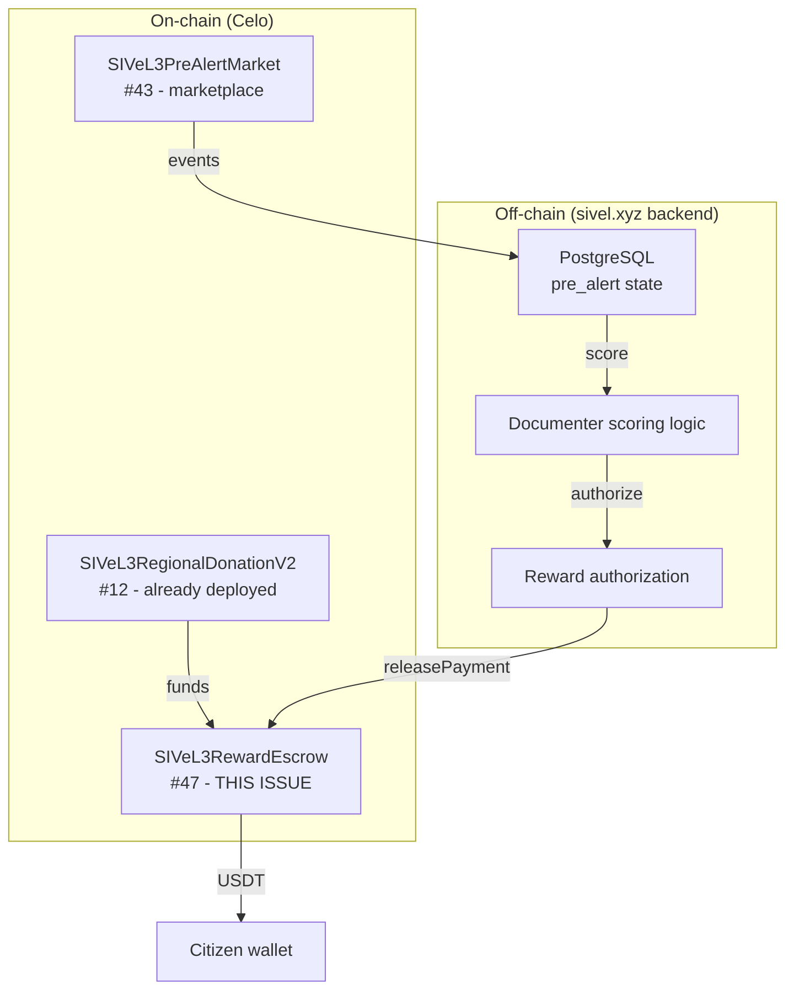

## Description

Implement a minimal, secure contract (`SIVeL3RewardEscrow`) that holds USDT and allows the `sivel.xyz` backend to release payments to citizens who have successfully converted a pre‑alert into a verified alert (after documenter scoring).

**Why a separate contract instead of reusing RegionalDonation?**
- `SIVeL3RegionalDonationV2` is designed for **donations** (incoming funds) and regional balance tracking.
- `SIVeL3RewardEscrow` is designed for **payouts** (outgoing funds) with a simple `BACKEND_ROLE` authorization.
- Separating concerns makes both contracts simpler, cheaper to operate, and easier to audit.

**Why not put rewards in PreAlertMarket?**
- `SIVeL3PreAlertMarket` (#43) handles the marketplace: publishing, buying, converting.
- Adding reward logic would make it complex and harder to upgrade.
- Separating rewards allows independent iteration (e.g., changing reward amounts without touching the marketplace contract).

---

## Architecture Overview



---

## Contract: SIVeL3RewardEscrow.sol

### Features

| Feature | Description |
|---------|-------------|
| **Deposit** | Admin (`DEFAULT_ADMIN_ROLE`) can deposit USDT from `SIVeL3RegionalDonationV2` or any other source. |
| **Release payment** | Backend (`BACKEND_ROLE`) can release USDT to a citizen's wallet. |
| **Emergency withdraw** | Admin can withdraw funds in case of emergency. |
| **Events** | `FundsDeposited`, `PaymentReleased`, `EmergencyWithdrawn`. |

### Code

```solidity
// SPDX-License-Identifier: MIT
pragma solidity ^0.8.20;

import "@openzeppelin/contracts/token/ERC20/IERC20.sol";
import "@openzeppelin/contracts/access/AccessControl.sol";
import "@openzeppelin/contracts/security/ReentrancyGuard.sol";

/**
 * @title SIVeL3RewardEscrow
 * @dev Minimal contract for releasing USDT rewards to citizens.
 *      Only BACKEND_ROLE can release payments.
 *      DEFAULT_ADMIN_ROLE can deposit and manage roles.
 */
contract SIVeL3RewardEscrow is AccessControl, ReentrancyGuard {
    bytes32 public constant BACKEND_ROLE = keccak256("BACKEND_ROLE");
    IERC20 public immutable usdtToken;

    event FundsDeposited(address indexed from, uint256 amount);
    event PaymentReleased(address indexed recipient, uint256 amount);
    event EmergencyWithdrawn(address indexed to, uint256 amount);

    constructor(address _usdtToken, address _backend) {
        require(_usdtToken != address(0), "Invalid USDT address");
        usdtToken = IERC20(_usdtToken);
        _grantRole(DEFAULT_ADMIN_ROLE, msg.sender);
        _grantRole(BACKEND_ROLE, _backend);
    }

    /**
     * @dev Deposits USDT into the contract.
     * @param amount Amount in USDT (6 decimals).
     */
    function deposit(uint256 amount) external onlyRole(DEFAULT_ADMIN_ROLE) nonReentrant {
        require(amount > 0, "Amount must be > 0");
        usdtToken.transferFrom(msg.sender, address(this), amount);
        emit FundsDeposited(msg.sender, amount);
    }

    /**
     * @dev Releases a payment to a citizen.
     * @param recipient Citizen's wallet address.
     * @param amount Amount in USDT (6 decimals).
     */
    function releasePayment(address recipient, uint256 amount) external onlyRole(BACKEND_ROLE) nonReentrant {
        require(recipient != address(0), "Invalid recipient");
        require(amount > 0, "Amount must be > 0");
        require(usdtToken.balanceOf(address(this)) >= amount, "Insufficient balance");

        usdtToken.transfer(recipient, amount);
        emit PaymentReleased(recipient, amount);
    }

    /**
     * @dev Emergency withdrawal by admin.
     * @param amount Amount in USDT (6 decimals).
     */
    function emergencyWithdraw(uint256 amount) external onlyRole(DEFAULT_ADMIN_ROLE) nonReentrant {
        require(usdtToken.balanceOf(address(this)) >= amount, "Insufficient balance");
        usdtToken.transfer(msg.sender, amount);
        emit EmergencyWithdrawn(msg.sender, amount);
    }

    /**
     * @dev Returns the USDT balance of this contract.
     */
    function balance() external view returns (uint256) {
        return usdtToken.balanceOf(address(this));
    }
}
```

---

## Integration with SIVeL3RegionalDonationV2

To fund `SIVeL3RewardEscrow` from the regional donation contract:

```bash
# Withdraw from RegionalDonation (Colombia, regionId=1) to RewardEscrow
./bin/m wallet:send --name sivel3 \
  --to $REGIONAL_DONATION_ADDRESS \
  --function "withdraw(uint256,uint256,address)" \
  --args "1,1000000,$REWARD_ESCROW_ADDRESS" \
  --network celo
```

**Note:** The backend wallet must have `OWNER_ROLE` on `SIVeL3RegionalDonationV2` to call `withdraw`.

---

## Integration with sivel.xyz Backend (#44)

### Modified `POST /api/pre-alerts/:id/score`

```typescript
// After documenter assigns score (2-5)
const rewardAmount = score * 1_000_000; // USDT 6 decimals

// 1. Check balance in RewardEscrow
const balance = await publicClient.readContract({
  address: REWARD_ESCROW_ADDRESS,
  abi: rewardEscrowAbi,
  functionName: 'balance',
});

if (balance < rewardAmount) {
  // Mark as pending_reward
  await db.updateTable('pre_alert').set({
    status: 'pending_reward',
    score: score,
    scored_by: documenterWallet,
    scored_at: new Date(),
  }).execute();

  return { success: false, reason: 'Insufficient funds in reward escrow' };
}

// 2. Release payment
const { request } = await publicClient.simulateContract({
  address: REWARD_ESCROW_ADDRESS,
  abi: rewardEscrowAbi,
  functionName: 'releasePayment',
  args: [citizenWallet, rewardAmount],
  account: BACKEND_WALLET,
});

const hash = await walletClient.writeContract(request);
await publicClient.waitForTransactionReceipt({ hash });

// 3. Update status to 'paid'
await db.updateTable('pre_alert').set({
  status: 'paid',
  score: score,
  scored_by: documenterWallet,
  scored_at: new Date(),
  tx_hash: hash,
}).execute();
```

---

## Deployment

### Environment Variables (`apps/.env`)

```bash
# Reward Escrow
REWARD_ESCROW_ADDRESS=0x...

# USDT (Celo Mainnet)
USDT_ADDRESS=0x48065fbbe25f71c9282ddf5e1cd6d6a887483d5e
```

### Deployment Script

```javascript
// apps/hardhat/deploy/03_deploy_reward_escrow.js
module.exports = async ({ getNamedAccounts, deployments }) => {
  const { deploy } = deployments;
  const { deployer } = await getNamedAccounts();
  const network = hre.network.name;

  const usdtAddress = network === 'celo' 
    ? process.env.USDT_ADDRESS
    : process.env.USDT_SEPOLIA_ADDRESS;

  const backendWallet = network === 'celo'
    ? process.env.BACKEND_WALLET_MAINNET
    : process.env.BACKEND_WALLET_SEPOLIA;

  await deploy("SIVeL3RewardEscrow", {
    from: deployer,
    args: [usdtAddress, backendWallet],
    log: true,
    waitConfirmations: 1,
  });
};
module.exports.tags = ["RewardEscrow"];
```

---

## Acceptance Criteria

- [x] Contract compiles with Solidity 0.8.24
- [x] `DEFAULT_ADMIN_ROLE` correctly assigned to deployer
- [x] `BACKEND_ROLE` correctly assigned to backend wallet
- [x] `deposit()` transfers USDT from admin to contract
- [x] `releasePayment()` transfers USDT from contract to recipient (only `BACKEND_ROLE`)
- [x] `releasePayment()` reverts if insufficient balance
- [x] `emergencyWithdraw()` allows admin to withdraw funds
- [x] Events emitted for all actions
- [ ] Contract verified on Celo Blockscout — **pending deployment**
- [x] Funded from `SIVeL3RegionalDonationV2` — **funding path documented**

---

## Implementation Status (2026-06-19)

### ✅ Completed

| File | Purpose |
|------|---------|
| `contracts/SIVeL3RewardEscrow.sol` | Contract — AccessControl + ReentrancyGuard, OZ 5.x |
| `test/SIVeL3RewardEscrow.test.ts` | 16 tests — deployment, deposit, release, emergency withdraw |
| `scripts/deployRewardEscrow.ts` | Saves to `deployments/SIVeL3RewardEscrow/V1/{network}.json` |
| `bin/deployRewardEscrow` | CLI wrapper for deployment |
| `bin/RewardEscrowSourceVerification` | Blockscout source verification |
| `bin/verifyRewardEscrow` | Smoke test — read‑only by default, write with `SMOKE_TEST_WRITE=true` |
| `apps/nextjs/abis/SIVeL3RewardEscrow.json` | ABI synced via `yarn compile` |
| `apps/nextjs/app/api/pre-alerts/[id]/score/route.ts` | Wired to `readDeployment()` + `releasePayment()` on-chain |
| `tests/pre-alerts.test.ts` | Updated score test to expect `pending_reward` fallback |

### 🔧 Score Endpoint Flow

```
Score 2-5 → check escrow balance via RPC
  ├── RPC down / no PRIVATE_KEY → status: pending_reward
  ├── balance < rewardAmount → status: pending_reward (retry later)
  └── balance ≥ rewardAmount → call releasePayment() → status: paid
```

### 🔧 Adaptation for OpenZeppelin 5.x

- `ReentrancyGuard` → `@openzeppelin/contracts/utils/ReentrancyGuard.sol`
- `AccessControl` stays at `@openzeppelin/contracts/access/AccessControl.sol` (unchanged in OZ 5.x)

### ⚠️ Platform Note

Tests cannot execute on OpenBSD (`@nomicfoundation/edr`). Compiled and ABI synced successfully.

### ⏳ Pending

| Task | Status |
|------|--------|
| Deploy + verify on Sepolia | ⏳ After PRIVATE_KEY + AGENT_WALLET_ADDRESS configured |
| Fund escrow from RegionalDonationV2 | ⏳ Manual: `bin/m wallet:send` or admin deposit |
| Smoke test with `SMOKE_TEST_WRITE=true` | ⏳ After deployment

---

## Dependencies

- Requires #43 (`SIVeL3PreAlertMarket`) – indirectly, as rewards depend on the marketplace flow.
- Requires `SIVeL3RegionalDonationV2` – for initial funding.
- Requires `sivel.xyz` backend (#44) to call `releasePayment`.

---

## Related Issues

- Epic: [#36](https://github.com/pasosdeJesus/sivel3/issues/36)
- Predecessor: #43 (PreAlertMarket), #44 (API endpoints)
- Related: #46 (State machine – off-chain)

---

## Notes for the Developer

- **Minimum viable contract:** No state management, no complex logic. Just deposit and release.
- **Security:** Only `BACKEND_ROLE` can release payments. The backend wallet should be a secure EOA or a multisig.
- **Funding:** The contract must be funded before any rewards can be paid. Use `deposit()` from the admin wallet, or `withdraw()` from `RegionalDonationV2`.
- **Upgradeability:** Not needed. This contract is simple enough to be replaced if requirements change.

---

> *"Whatever you do, work at it with all your heart, as working for the Lord, not for human masters."* (Colossians 3:23)
