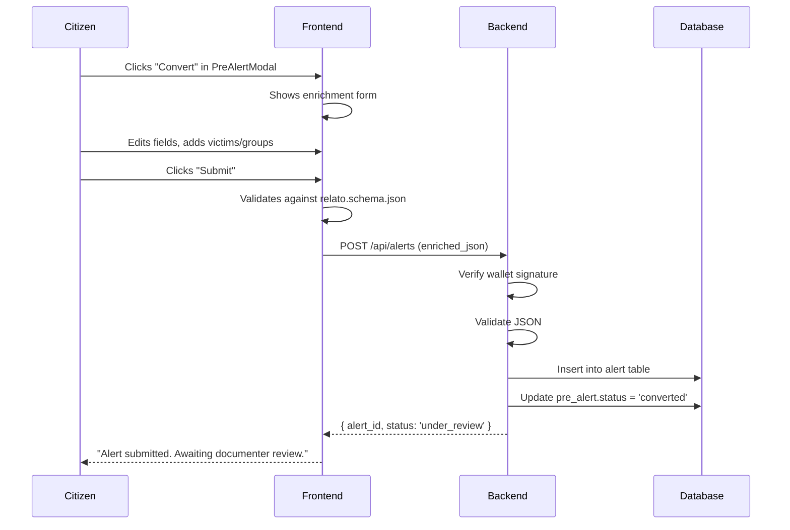

## Description

Replace the current "Convert" button in `PreAlertModal` with a **simple enrichment form** that allows citizens to review, correct, and add missing information to a pre-alert before submitting it as a citizen alert.

This issue also includes the **backend infrastructure** needed to persist the enriched data: the `alert` table and the `POST /api/alerts` endpoint.

**Key principle:** The citizen is **improving** an existing pre-alert, not building a case from scratch. This keeps the form simple and focused for the MVP.

**Future-ready design:** The form components (victim adder, group selector, etc.) are built as **reusable blocks** so that in the future they can be composed into a "Direct Alert" form for citizens submitting alerts without a pre-alert.

---

## Database Table: `alert`

```sql
CREATE TABLE alert (
    id SERIAL PRIMARY KEY,
    pre_alert_id INTEGER REFERENCES pre_alert(id) ON DELETE CASCADE,
    wallet VARCHAR(42) NOT NULL,
    json_data JSONB NOT NULL,           -- enriched_json from citizen
    status VARCHAR(20) DEFAULT 'under_review',  -- under_review, scored, rejected
    score INTEGER CHECK (score >= 0 AND score <= 5),
    scored_by VARCHAR(42),
    scored_at TIMESTAMP,
    feedback TEXT,
    created_at TIMESTAMP DEFAULT NOW(),
    updated_at TIMESTAMP DEFAULT NOW()
);

CREATE INDEX idx_alert_pre_alert_id ON alert(pre_alert_id);
CREATE INDEX idx_alert_status ON alert(status);
CREATE INDEX idx_alert_wallet ON alert(wallet);
```

---

## API Endpoint: `POST /api/alerts`

Creates a new citizen alert from enriched pre-alert data.

**Authentication:** Wallet signature (EIP-191) — the citizen signs a message to prove ownership of the wallet.

**Request:**
```json
{
    "pre_alert_id": 42,
    "enriched_json": {
        "titulo": "Asesinato de líder social en Puerto Guzmán",
        "hechos": "Presuntos integrantes del grupo paramilitar Comandos de la Frontera asesinaron al líder social...",
        "fecha": "2025-09-07",
        "hora": "10:00 AM",
        "departamento": "Putumayo",
        "municipio": "Puerto Guzmán",
        "personas": [
            { "id_persona": "temp_001", "nombre": "JHON FREDY", "apellido": "RICO", "sexo": "M" }
        ],
        "grupos": [
            { "id_grupo": "14", "nombre_grupo": "PARAMILITARES" }
        ],
        "actos": [
            {
                "agresion": "VIDA",
                "agresion_particular": "B40: ASESINATO POLÍTICO (VPS - Persecución Política)",
                "id_victima_individual": "temp_001",
                "id_presunto_grupo_responsable": "14"
            }
        ],
        "contextos": ["PERSECUCIÓN A ORGANIZACIÓN"]
    },
    "additional_data": "optional notes"
}
```

**Validation:**
- `pre_alert_id` must exist and belong to the citizen (`pre_alert.buyer_wallet == wallet`)
- `pre_alert.status` must be `reserved`
- `enriched_json` must validate against `relato.schema.json` (using `ajv`)
- `enriched_json` must have at least one `persona` or `victima`

**Flow:**
1. Verify wallet signature
2. Validate `enriched_json` against `relato.schema.json`
3. Check `pre_alert` exists, is `reserved`, and belongs to the citizen
4. Insert into `alert` table with status `under_review`
5. Update `pre_alert.status = 'converted'`
6. Create notification for documenters (new alert in queue)

**Response (201 Created):**
```json
{
    "success": true,
    "alert_id": 123,
    "status": "under_review",
    "pre_alert_id": 42
}
```

**Error responses:**
- `401 Unauthorized`: Invalid signature
- `400 Bad Request`: Invalid JSON (fails schema validation)
- `403 Forbidden`: Not the buyer of the pre-alert
- `409 Conflict`: Already converted (pre_alert.status != 'reserved')
- `422 Unprocessable Entity`: Missing required fields (e.g., no victims)

---

## Frontend: Enrichment Form

### 1. Pre-alert display (read-only)

Show the pre-alert's current data in a **readable, non-technical format**:

| Field | Display |
|-------|---------|
| `titulo` | Title |
| `hechos` | Summary of events |
| `fecha` | Date |
| `departamento` | Department |
| `municipio` | Municipality |
| `personas` | List of victims (names) |
| `grupos` | List of responsible groups |
| `actos` | List of acts (aggression types) |

### 2. Editable fields

Allow the citizen to edit the **most critical fields**:

| Field | Component | Notes |
|-------|-----------|-------|
| `titulo` | Text input | Max 50 chars |
| `hechos` | Textarea | Can be expanded |
| `fecha` | Date picker | If incorrect |
| `departamento` | Dropdown (Colombia departments) | If missing/incorrect |
| `municipio` | Text input | If missing/incorrect |

### 3. Adding elements

Provide **simple "Add" buttons** that open a small form:

| Element | Form | Notes |
|---------|------|-------|
| **Add victim** | `nombre`, `apellido`, `sexo` | Appears in list below |
| **Add group** | Select from list OR write name | Pre-filled with common groups |
| **Add act** | Select `agresion` (VIDA/INTEGRIDAD/LIBERTAD) and `agresion_particular` | Pre-filled with common codes |

### 4. Removing elements

Allow removal of incorrectly added elements (only what the citizen added, not the original pre-alert data).

### 5. Diff view (MVP)

Show a simple summary of changes before submission:

```
📝 Cambios realizados:
  ✏️ hechos: "..." → "..."
  ➕ Víctima: JOHN FREDY RICO (M)
  ➕ Grupo: PARAMILITARES
```

### 6. Validation

- Before submission, validate the enriched JSON against `relato.schema.json` using `ajv`.
- Show clear error messages for missing/invalid fields.
- If validation passes, submit via `POST /api/alerts`.

### 7. Mobile-friendly

- Full-width inputs
- Stack vertically
- Touch-friendly buttons (min 44px height)

---

## Integration with Existing Flow



---

## Acceptance Criteria (MVP)

- [ ] `alert` table created via migration
- [ ] `POST /api/alerts` endpoint implemented with:
  - Wallet signature authentication
  - Validation against `relato.schema.json`
  - Link to `pre_alert`
  - Update `pre_alert.status = 'converted'`
- [ ] Frontend enrichment form:
  - Displays pre-alert data in readable format
  - Allows editing of `titulo`, `hechos`, `fecha`, `departamento`, `municipio`
  - Allows adding `personas`, `grupos`, `actos`
  - Allows removing added elements
  - Shows diff view before submission
  - Validates JSON before submission
  - Mobile-friendly
- [ ] Submission via `POST /api/alerts`
- [ ] Success message with `alert_id` and status
- [ ] Components are structured to be reused for direct alerts

---

## Future Acceptance Criteria (Post-MVP)

- [ ] Citizens can submit "Direct Alerts" without a pre-alert
- [ ] Direct alerts use the same components as the enrichment form
- [ ] Direct alerts enter the same `UnderReview` queue
- [ ] Direct alerts are scored and rewarded the same way

---

## Dependencies

- Requires #44 (pre-alert API endpoints) — for retrieving pre-alert data
- Requires #48 (MVP frontend — `PreAlertModal` component)
- Requires `ajv` + `relato.schema.json` schema file
- Requires `zod` for form validation (optional, can use `ajv` only)

---

## Related Issues

- Parent: #48 (MVP frontend)
- Related: #44 (API endpoints)
- Future: #?? (Direct Alert submission)

---

> *"Whatever you do, work at it with all your heart, as working for the Lord, not for human masters."* (Colossians 3:23)
