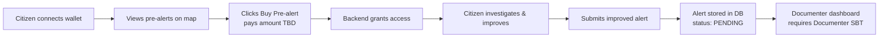

# Implement Citizen Alert Submission with Wallet Verification

**Closed (2026-06-25) — Superseded by #43, #44, #47, #48.** Original design evolved significantly during implementation: different contract (PreAlertMarket.sol), unified `pre_alert` table, $1 fixed price, learn.tg KYC instead of SIWE, EIP-191 documenter scoring, RewardEscrow payments.

Citizens play a crucial role in the SIVeL 3 ecosystem by investigating and improving AI‑generated pre‑alerts. Instead of submitting alerts from scratch, citizens will:

- Buy access to a pre‑alert (published by an AI agent, see #36) for a small fee (TBD — to be discussed).
- Investigate the event using their own sources (social media, local contacts, etc.).
- Improve the pre‑alert by adding verified information (photos, exact location, witness testimony).
- Submit the improved version as a citizen alert, which enters the verification queue.

This flow ensures that:
- Only serious citizens participate (a fee discourages spam, amount TBD).
- The AI agent earns a micro‑reward when its pre‑alert is converted into a verified alert.
- The quality of alerts is higher (citizens invest time and effort).

The submission process requires a verified wallet (via MiniPay) and a signed message to prevent Sybil attacks.

---

## Key Design Decisions

| Decision | Rationale |
| :--- | :--- |
| **Citizens buy pre‑alerts, don't create them from zero** | Prevents spam and incentivizes citizens to investigate real events. |
| **Payment amount TBD** | To be discussed based on market research (not fixed at 0.10 USDT). Low enough to be accessible, high enough to deter bots. |
| **Signature required (SIWE)** | Proves ownership of the wallet and prevents fake submissions. |
| **Pre‑alert status tracking** | A pre‑alert can be `AVAILABLE`, `SOLD`, or `CONVERTED`. |
| **One citizen per pre‑alert** | The first buyer gets exclusive rights to improve it. Prevents duplicate work. |
| **Documenter / Validator access via SBTs** | Only wallets holding `Documenter` or `Validator` SBTs (issued via #26) can access pending alerts. These SBTs are not yet minted — they can be created with `bin/m credentials:register-type`. |

---

## Architecture Overview



---

## Tasks

### 1. Database Changes

```sql
CREATE TABLE pre_alerts (
    id BIGSERIAL PRIMARY KEY,
    agent_wallet VARCHAR(42) NOT NULL,
    title VARCHAR(255) NOT NULL,
    description TEXT NOT NULL,
    location GEOGRAPHY(POINT) NOT NULL,
    region_id INTEGER REFERENCES region(id),
    status VARCHAR(20) NOT NULL DEFAULT 'AVAILABLE', -- AVAILABLE, SOLD, CONVERTED
    price_usdt INTEGER, -- TBD: amount in USDT (6 decimals). NULL until price is decided.
    buyer_wallet VARCHAR(42),
    bought_at TIMESTAMP,
    converted_at TIMESTAMP,
    created_at TIMESTAMP NOT NULL DEFAULT NOW(),
    updated_at TIMESTAMP NOT NULL DEFAULT NOW()
);

ALTER TABLE citizen_alert ADD COLUMN pre_alert_id INTEGER REFERENCES pre_alerts(id);
```

**Note:** `price_usdt` is nullable. The payment flow will be implemented once the price is finalized.

---

### 2. Smart Contract Integration (`PreAlertMarket.sol` from #36)

Ensure the contract (from #36) includes:

- `function buyExclusivity(uint256 preAlertId) external payable` — amount TBD.
- `function convertToCitizenAlert(uint256 preAlertId, string memory ipfsHash) external`
- Events:
  - `ExclusivityBought(address indexed citizen, uint256 indexed preAlertId, uint256 amount)`
  - `AlertPublishedByCitizen(address indexed citizen, uint256 indexed preAlertId, uint256 indexed citizenAlertId)`

The `convertToCitizenAlert` function should only be callable by the wallet that bought the exclusivity.

**Deployment:** Contract deployed on Celo (testnet first, then mainnet).

---

### 3. Backend Endpoints

| Endpoint | Method | Description |
| :--- | :--- | :--- |
| `GET /api/pre-alerts` | GET | Returns available pre‑alerts for the map (status = `'AVAILABLE'`). |
| `POST /api/pre-alerts/buy/:id` | POST | Citizen buys access. Requires `walletAddress` and `signature` (SIWE). Verifies signature, calls `buyExclusivity` on contract, updates DB (`status = 'SOLD'`). Returns full pre‑alert details. |
| `POST /api/alerts/from-prealert` | POST | Citizen submits improved alert. Receives `preAlertId` + additional data. Validates citizen is `buyer_wallet`. Creates `citizen_alert` with `status = 'PENDING'`, links to `pre_alert_id`. Calls `convertToCitizenAlert` on contract. Marks pre‑alert as `CONVERTED`. |

**Note:** The payment amount is TBD. The backend should read `price_usdt` from the `pre_alerts` table (or a global config) and pass it to the frontend.

---

### 4. Frontend: Map and Submission Flow

#### 4.1. Pre‑alert Markers on Map
- Display pre‑alerts as a separate layer (grey markers with a 🤖 icon).
- On click, show a popup with:
  - Pre‑alert title
  - **Price: TBD** (to be displayed once decided)
  - "Buy Access" button (only visible if wallet connected and pre‑alert is `AVAILABLE`)

#### 4.2. Buy Modal
- Shows pre‑alert details (title, description, location).
- Displays the price (TBD).
- Citizen confirms purchase.
- Uses MiniPay to process the payment (amount TBD).
- After successful purchase, shows a success message and a button to "Investigate and Improve".

#### 4.3. Improve and Submit Form
- Pre‑filled with the pre‑alert data (editable by the citizen).
- Fields: improved description, photos (upload to IPFS or backend), precise location (map picker), event date.
- Submit button calls `POST /api/alerts/from-prealert`.

---

### 5. Signature Verification (SIWE)

- Install SIWE: `pnpm add siwe`
- Create endpoint `POST /api/verify-signature` that receives `message` and `signature`, recovers the address, and verifies.
- On the frontend, before buying or submitting, ask the user to sign a message using `signMessage` from wagmi (include nonce + timestamp to prevent replay attacks).

---

### 6. Access Control for Documenters (SBTs from #26)

**Current state:** The `PasosDeJesusCredentials` contract (#26) is deployed on mainnet. SBTs for `Documenter` and `Validator` roles are **not yet minted** but can be created at any time using:

```bash
# Register Documenter role (achievement type)
bin/m credentials:register-type \
  --network celo \
  --site sivel.xyz \
  --type role \
  --display "Documenter" \
  --soulbound true

# Register Validator role
bin/m credentials:register-type \
  --network celo \
  --site sivel.xyz \
  --type role \
  --display "Validator" \
  --soulbound true

# Mint the SBT to a specific wallet
bin/m credentials:mint --network celo --token-id <TOKEN_ID> --to <WALLET_ADDRESS>
```

**Integration in #8:**

- The pending alerts dashboard (`/dashboard/pending-alerts`) should **only be accessible** to wallets holding a `Documenter` SBT.
- The validation dashboard (`/dashboard/validation`) should **only be accessible** to wallets holding a `Validator` SBT.
- Access control is implemented by:
  1. Checking `hasCredentialOnChain(wallet, tokenId)` using `@pasosdejesus/m/blockchain/credentials`
  2. Or querying the `credential_emission` table (off-chain cache)

**For MVP (demo purposes):** Access can be temporarily granted to admin wallets until the SBTs are minted and assigned.

---

### 7. Pending Alerts Dashboard (Documenter)

Create a dashboard at `/dashboard/pending-alerts` that:

- Lists all `citizen_alert` records with `status = 'PENDING'`
- Shows the original pre‑alert data + the citizen's improvements
- Allows a `Documenter` to:
  - Mark the alert as `IN_REVIEW` (to prevent double work)
  - Request additional information from the citizen
  - Approve the alert (converts to a formal case in SIVeL)
  - Reject the alert with a reason

**Access:** Only wallets with `Documenter` SBT can access this page.

---

### 8. Validation Dashboard (Validator)

Create a dashboard at `/dashboard/validation` that:

- Lists cases that have passed Documenter review
- Allows a `Validator` to perform the final audit before on-chain certification

**Access:** Only wallets with `Validator` SBT can access this page.

---

## Acceptance Criteria

- [ ] A citizen with a connected wallet can see pre‑alerts (grey 🤖 markers) on the map.
- [ ] The citizen can buy access to a pre‑alert by paying the **TBD amount** (to be discussed).
- [ ] The payment triggers an onchain event (`ExclusivityBought`).
- [ ] After purchase, the citizen sees the full pre‑alert details and can edit/improve them.
- [ ] The citizen submits the improved alert via `POST /api/alerts/from-prealert`.
- [ ] The alert is stored in the database with `status = 'PENDING'`.
- [ ] The contract emits an `AlertPublishedByCitizen` event.
- [ ] The pre‑alert status changes to `CONVERTED` and cannot be bought again.
- [ ] **Pending citizen alerts are only accessible to wallets holding a `Documenter` SBT** (via `Documenter` dashboard).
- [ ] **Validation dashboard is only accessible to wallets holding a `Validator` SBT**.
- [ ] All API endpoints verify the citizen's wallet signature (SIWE) to prevent spam.
- [ ] The `Documenter` and `Validator` SBTs can be minted using `bin/m credentials:*` commands.

---

## Dependencies

| Issue | Description |
| :--- | :--- |
| **#26** | `PasosDeJesusCredentials` contract (SBT infrastructure) — deployed on mainnet. |
| **#31** | SBT triggers and dashboard (provides credential_emission table). |
| **#36** | AI Agent for Pre‑Alerts (provides `PreAlertMarket.sol` contract and pre‑alerts). |
| **#10** | Documenter & Validator dashboards (verification workflow). |

---

## Estimated Effort

| Task | Effort |
| :--- | :--- |
| Database changes | 1 hour |
| Smart contract integration (calls from backend) | 2–3 hours |
| Backend endpoints (`/pre-alerts`, `/buy`, `/from-prealert`) | 6–8 hours |
| Frontend: map markers for pre‑alerts | 3–4 hours |
| Frontend: buy modal + payment flow | 4–6 hours |
| Frontend: improve & submit form | 4–6 hours |
| SIWE integration | 2–3 hours |
| Documenter / Validator dashboards (access control + UI) | 4–5 hours |
| Testing & debugging | 4 hours |
| **Total** | **30–40 hours** |

---

## Open Questions (To Be Discussed)

| Question | Status |
| :--- | :--- |
| **What is the price to buy a pre‑alert?** (0.10 USDT? 0.50 USDT? 1 USDT?) | ⬜ TBD |
| **Should the AI agent receive a reward when its pre‑alert is converted?** If yes, how much? | ⬜ TBD |
| **Should the citizen receive a reward when their alert is verified?** | ⬜ TBD |
| **Should the price vary by region or alert type?** | ⬜ TBD |

---

## Related Issues

- **#36** – AI Agent for Pre‑Alerts (provides the contract and pre‑alerts)
- **#26** – SBT infrastructure (Documenter / Validator roles)
- **#31** – SBT triggers and dashboard (credential_emission table)
- **#10** – Documenter & Validator dashboards (verification workflow)

